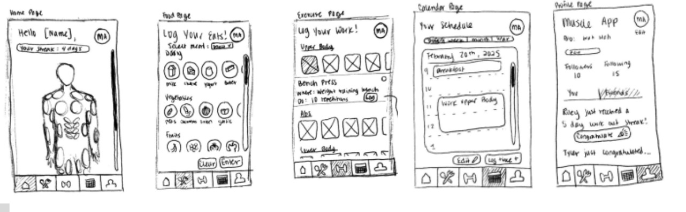
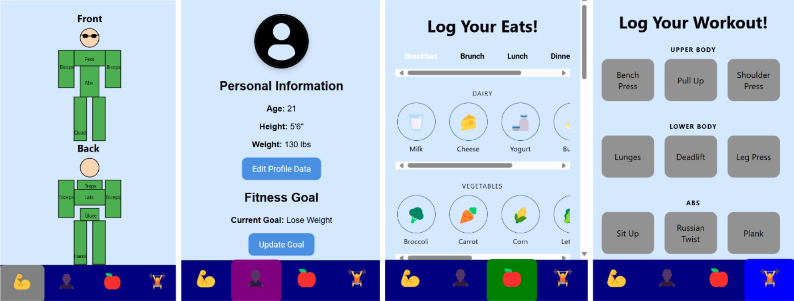

# 🏋️‍♀️ FitTrack – Smart Fitness Tracker App

**FitTrack** is a clean, modular, and user-friendly fitness tracking app designed to help users monitor their workouts, track muscle usage, set personal fitness goals, and log meals—while maintaining an intuitive and visually consistent interface.

---

## 🚀 Features

### 🔄 Cross-Module Navigation
- Persistent **bottom navigation bar** with four main tabs:
  - 🧠 **Muscle Map** – View muscle activation and injury risk.
  - 👤 **Profile** – Manage personal information and fitness goals.
  - 🍱 **Diet Tracker** – Log daily food intake with emoji-friendly input.
  - 🏋️ **Workout Log** – Record workouts by body region with set/reps.

### 🎨 Visual & Interaction Design
- **Unified design language** with consistent color scheme and spacing.
- **Rounded buttons** and high contrast colors for accessibility.
- **Emoji icons** replace traditional UI icons for a fun, lightweight aesthetic.
- Designed for clarity, inclusiveness (e.g. color-blind accessibility), and minimal visual clutter.

### 💪 Muscle Map
- Simplified front/back body diagrams.
- Color-coded muscle areas show usage intensity.
- Helps users become aware of strain or overtraining risks.

### 👤 Profile & Goals
- Displays user height, weight, age, and goals.
- Users can **edit their data** with progressive disclosure (fields hidden until "Edit" is clicked).
- Clean separation between profile data and goal-setting to reduce cognitive load.

### 🧘‍♀️ Diet Tracker
- Quick-add meal logging via emoji categories (e.g., 🥦 vegetables, 🍗 protein).
- Optimized for touch interaction.

### 🏋️ Workout Logger
- Categorized by upper body, lower body, and core.
- Log specific exercises and sets via modular cards.
- Consistent layout and interaction design across all exercise types.

### 📅 Workout History
- Interactive calendar view highlights completed workouts with emoji icons.
- Clicking on a day shows logged activities.
- Supports habit tracking and streak awareness.

---

## 🧠 UX Principles

- **Progressive disclosure**: Optional fields appear only when needed to reduce clutter.
- **Immediate feedback**: UI updates instantly reflect user actions (e.g., profile changes, workout logs).
- **Affordances & signifiers**: Clear button styling and feedback.
- **Consistency**: Design patterns reused across screens for seamless flow.
- **Error prevention**: Confirmation prompts for sensitive actions like logout and delete.

---

## 📸 Screenshots

